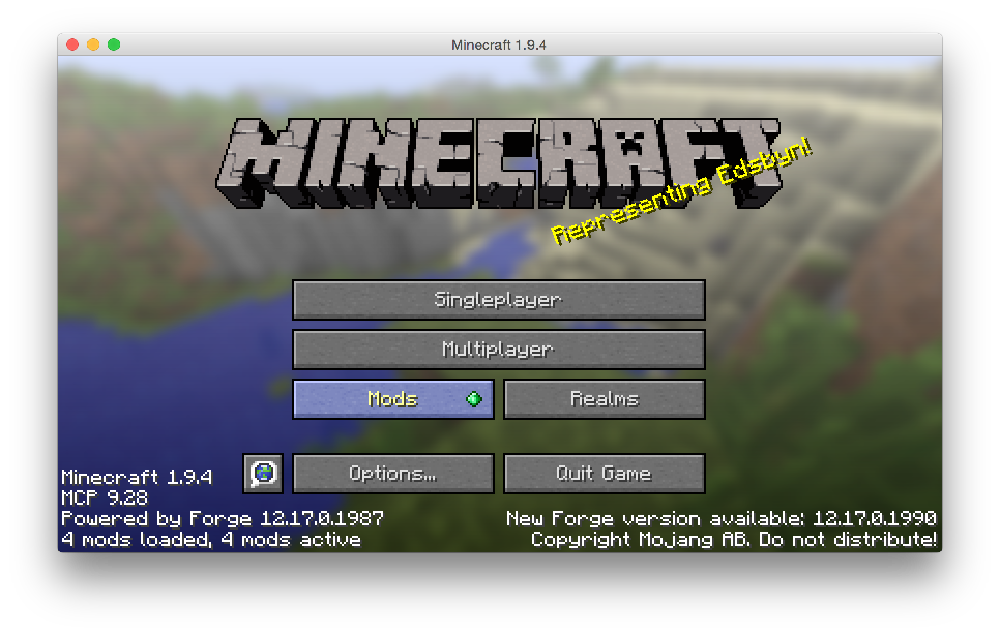

= Minecraft Hue Dataflow

This project contains the required bits necessary to run a Spring Cloud Dataflow demo that shows
how easy it is to integrate the most exotic things together, for example Minecraft and a physical object such
as Philips Hue lightbulbs.

== Architecture

== Project Layout
This repository contains the following files of interest:

link::minecraft-tcpevent-mod[`minecraft-tcpevent-mod/`]:: A minecraft Mod, using the the Minecraft Forge framework.
This is a Gradle project and
 is meant to be built separately.
link::hue-sink[`hue-sink/`]:: A Spring Boot App, leveraging Spring Cloud Stream annotations, so it can be used as a Dataflow sink.
This app can interact with Philips Hue lightbulbs using the REST API exposed by a Philips Hue bridge
link::map-sink[`map-sink/`]:: Another Boot sink app, but this time a GUI that displays moving entities in the Minecraft
game by reacting
to update events
link::stream-application-rabbit-maven[`stream-application-rabbit-maven`]:: A convenience file used to register all
out-of-the-box Dataflow applications as well
 as the `hue-sink` app and the `map-sink` app contained in this project.
`HueEmulator-v0.7.jar`:: An emulator that can be used if you don't have access to a real Philips Hue system.

== Building and Running
=== Building the Boot apps
Each Boot app is a standalone Maven project. The root of this repository also contains a parent `pom.xml` file that
allows them to be built all at once. Hence,
```bash
minecraft-hue-dataflow $> ./mwnw clean install
```
should build everything you need.

[NOTE]
.About shells
====
In these instructions, a prompt of `XXX $>` indicates a command to run in your OS shell, while in the XXX directory
(assuming this repository has been cloned in a directory named `minecraft-hue-dataflow`).

On the other hand, a prompt of `dataflow>` (no dollar sign) means the command should be entered using the
Dataflow Shell.
====

=== Building and Running the Minecraft Mod
The Minecraft Mod relies on Minecraft Forge modding support. You can read more about Forge on its website, but
to simply run the demo, you only need to
```bash
minecraft-hue-dataflow/minecraft-tcpevent-mod $> ./gradlew runClient
```
This will compile and package the mod and run a Minecraft Client with the mod already installed. You can configure the
mod itself (for example choosing which type of events are emitted) by clicking on the "Mods" button.



=== Running the Hue Emulator
In case you don't have access to a real Hue system, you can still run these demos by using the
https://github.com/SteveyO/Hue-Emulator[Hue Emulator].
The executable jar for version 0.7 is available in this repository, as well as a configuration script that registers
the same user as the default in link:hue-sink/src/main/java/io/springoneplatform/dataflow/hue/HueSinkProperties.java[HueSinkProperties.java].
To run:
```bash
minecraft-hue-dataflow $> sudo java -jar HueEmulator-v0.7.jar hue-config.json
```
Running with `sudo` allows you to bind to port 80, which again is the default. You can of course choose another port and
later configure the `hue-sink` app like so:
```
dataflow> stream create foo --definition "... | hue --port=8080" -deploy
```

=== Getting started with Dataflow

Now that all the pieces are in place, it's time to create and deploy streams with Dataflow.
Let's start by monitoring moving sheeps on the map:
```
dataflow
```
